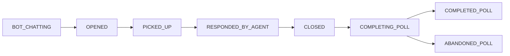

# Feature 001: B2Chat Full Status Support

**Status:** ✅ Implemented
**Version:** 1.0.0
**Date:** October 23, 2025

## Overview

This feature expands B2Chat Analytics status tracking from 3 simplified statuses (open, closed, pending) to the full 8-status lifecycle provided by the B2Chat API, including bot interactions and customer satisfaction survey tracking.

## Status Lifecycle

### Full 8-Status Flow



### Status Definitions

| Status | Description | Key Timestamps | Color |
|--------|-------------|----------------|-------|
| `BOT_CHATTING` | Chat being handled by bot before human agent | `createdAt` | 🟣 Purple |
| `OPENED` | Available for agent pickup (not yet assigned) | `openedAt` | 🔵 Blue |
| `PICKED_UP` | Agent has accepted and is handling the chat | `pickedUpAt` | 🔷 Cyan |
| `RESPONDED_BY_AGENT` | Agent has sent first response to customer | `responseAt` | 🟢 Green |
| `CLOSED` | Chat completed (no survey initiated) | `closedAt` | ⚫ Gray |
| `COMPLETING_POLL` | Awaiting customer satisfaction survey response | `pollStartedAt` | 🟠 Orange |
| `COMPLETED_POLL` | Customer completed satisfaction survey | `pollCompletedAt` | 🟩 Emerald |
| `ABANDONED_POLL` | Customer did not complete survey within timeout | `pollAbandonedAt` | 🔴 Rose |

### Legacy Status Mapping

For backward compatibility, legacy statuses are still supported:
- `open` → Maps to `PICKED_UP` in the new system
- `closed` → Maps to `CLOSED` in the new system
- `pending` → Maps to `OPENED` in the new system

## Database Schema Changes

### New Fields in `chats` Table

```sql
-- Survey-related timestamps
pollStartedAt    TIMESTAMP    -- When survey was initiated
pollCompletedAt  TIMESTAMP    -- When customer completed survey
pollAbandonedAt  TIMESTAMP    -- When survey timed out
pollResponse     JSONB        -- Customer survey response data
```

### Indexes Added

```sql
CREATE INDEX chats_poll_started_at_idx ON chats(poll_started_at);
CREATE INDEX chats_poll_completed_at_idx ON chats(poll_completed_at);
CREATE INDEX chats_poll_abandoned_at_idx ON chats(poll_abandoned_at);
CREATE INDEX chats_status_poll_idx ON chats(status, poll_started_at)
  WHERE poll_started_at IS NOT NULL;
```

### Migration

Run the database migration:
```bash
cd b2chat-analytics
npx prisma migrate deploy
```

Or apply manually:
```bash
psql $DATABASE_URL < prisma/migrations/20251023000001_expand_chat_status_enum/migration.sql
```

## API Reference

### Bot Performance Analytics

**Endpoint:** `GET /api/analytics/bot-performance`

**Query Parameters:**
- `days` (optional): Number of days to analyze (1-365, default: 30)

**Response:**
```json
{
  "timeRange": {
    "days": 30,
    "startDate": "2025-09-23T00:00:00Z",
    "endDate": "2025-10-23T00:00:00Z"
  },
  "summary": {
    "totalBotInteractions": 1250,
    "currentlyWithBot": 45,
    "resolvedByBot": 780,
    "handedOffToHuman": 425,
    "botResolutionRate": 62.4,
    "avgBotHandlingTimeSeconds": 180,
    "avgHandoffTimeSeconds": 45
  },
  "trends": {
    "resolutionRateChange": 3.2,
    "improving": true
  },
  "byChannel": [
    {
      "channel": "whatsapp",
      "total": 800,
      "resolvedByBot": 520,
      "handedOff": 280,
      "resolutionRate": 65.0
    }
  ]
}
```

**Metrics Explained:**
- `botResolutionRate`: Percentage of chats resolved without human intervention
- `avgBotHandlingTimeSeconds`: Average time bot spends with customer before handoff
- `avgHandoffTimeSeconds`: Average time from OPENED to PICKED_UP status

### Survey Metrics Analytics

**Endpoint:** `GET /api/analytics/survey-metrics`

**Query Parameters:**
- `days` (optional): Number of days to analyze (1-365, default: 30)

**Response:**
```json
{
  "timeRange": {
    "days": 30,
    "startDate": "2025-09-23T00:00:00Z",
    "endDate": "2025-10-23T00:00:00Z"
  },
  "summary": {
    "totalSurveysStarted": 500,
    "totalCompleted": 320,
    "totalAbandoned": 150,
    "totalPending": 30,
    "completionRate": 64.0,
    "abandonmentRate": 30.0,
    "avgCompletionTimeSeconds": 45,
    "avgAbandonmentTimeHours": 18.5
  },
  "ratings": {
    "avgRating": 4.2,
    "totalResponses": 320,
    "distribution": {
      "1": 10,
      "2": 15,
      "3": 45,
      "4": 120,
      "5": 130
    },
    "nps": 68,
    "totalComments": 180
  },
  "trends": {
    "completionRateChange": 5.3,
    "improving": true
  },
  "byChannel": [...],
  "dailyBreakdown": [...]
}
```

**Metrics Explained:**
- `completionRate`: Percentage of surveys completed by customers
- `abandonmentRate`: Percentage of surveys not completed (timeout)
- `nps`: Net Promoter Score calculated from ratings (promoters - detractors)
- `avgCompletionTimeSeconds`: Average time for customers to complete survey
- `avgAbandonmentTimeHours`: Average time before survey is marked as abandoned

## Frontend Components

### StatusBadge Component

```tsx
import { StatusBadge } from '@/components/chats/status-badge'

// Basic usage
<StatusBadge status="PICKED_UP" />

// Without icon
<StatusBadge status="COMPLETED_POLL" showIcon={false} />

// Different sizes
<StatusBadge status="BOT_CHATTING" size="sm" />
<StatusBadge status="OPENED" size="lg" />

// With tooltip showing full timeline
<StatusBadgeWithTooltip
  status="COMPLETED_POLL"
  createdAt={chat.createdAt}
  openedAt={chat.openedAt}
  pickedUpAt={chat.pickedUpAt}
  pollStartedAt={chat.pollStartedAt}
  pollCompletedAt={chat.pollCompletedAt}
/>
```

### Utility Functions

```tsx
import {
  getStatusColor,
  getStatusLabel,
  getStatusIcon
} from '@/lib/chat-utils'

// Get Tailwind CSS classes for badge
const colorClasses = getStatusColor('PICKED_UP')
// Returns: 'bg-cyan-50 text-cyan-700 border-cyan-200 hover:bg-cyan-100'

// Get human-readable label
const label = getStatusLabel('RESPONDED_BY_AGENT')
// Returns: 'Responded'

// Get emoji icon
const icon = getStatusIcon('BOT_CHATTING')
// Returns: '🤖'
```

## Validation Rules

The validation engine checks for data consistency:

### Timeline Validation
- `createdAt` ≤ `openedAt` ≤ `pickedUpAt` ≤ `responseAt` ≤ (`closedAt` | `pollStartedAt`)
- Chats with `closedAt` must have status `CLOSED`, `COMPLETED_POLL`, or `ABANDONED_POLL`
- `CLOSED` status requires `closedAt` (unless transitioning to survey)

### Survey Validation
- `COMPLETING_POLL` status must have `pollStartedAt`
- `COMPLETED_POLL` status must have `pollStartedAt` AND `pollCompletedAt`
- `ABANDONED_POLL` status must have `pollStartedAt` AND `pollAbandonedAt`
- Cannot have both `pollCompletedAt` and `pollAbandonedAt` (mutually exclusive)
- `pollResponse` should only exist for `COMPLETED_POLL` status
- Warning: `COMPLETING_POLL` for >24 hours should be marked `ABANDONED_POLL`

## Usage Examples

### Querying Bot Performance

```tsx
// Fetch bot metrics for last 30 days
const response = await fetch('/api/analytics/bot-performance?days=30')
const data = await response.json()

console.log(`Bot resolution rate: ${data.summary.botResolutionRate}%`)
console.log(`Currently with bot: ${data.summary.currentlyWithBot} chats`)
```

### Querying Survey Metrics

```tsx
// Fetch survey metrics for last 7 days
const response = await fetch('/api/analytics/survey-metrics?days=7')
const data = await response.json()

console.log(`Survey completion rate: ${data.summary.completionRate}%`)
console.log(`Average rating: ${data.ratings.avgRating}/5`)
console.log(`NPS Score: ${data.ratings.nps}`)
```

### Displaying Chat Status

```tsx
import { StatusBadge } from '@/components/chats/status-badge'

function ChatList({ chats }) {
  return (
    <div>
      {chats.map(chat => (
        <div key={chat.id}>
          <h3>{chat.customer}</h3>
          <StatusBadge status={chat.status} />

          {/* Show survey info if available */}
          {chat.pollResponse && (
            <div>
              Rating: {chat.pollResponse.rating}/5
              {chat.pollResponse.comment && (
                <p>{chat.pollResponse.comment}</p>
              )}
            </div>
          )}
        </div>
      ))}
    </div>
  )
}
```

## Testing

All features are covered by unit tests:

```bash
# Run all tests
npm test

# Run specific test suites
npm test -- client.test.ts          # B2Chat client (28 tests)
npm test -- change-detector.test.ts # Change detector (10 tests)
```

**Test Coverage:**
- ✅ Status parsing for all 8 statuses
- ✅ Legacy status mapping
- ✅ Survey field extraction
- ✅ Change detection
- ✅ Timeline validation

## Performance Considerations

### Database Indexes
Four new indexes were added to optimize survey queries:
- Single-column indexes on each survey timestamp field
- Composite index on `(status, pollStartedAt)` for filtered queries

### API Response Caching
Both analytics endpoints use Next.js revalidation:
```typescript
export const revalidate = 30 // Cache for 30 seconds
```

### Query Optimization
- Queries use time-based windows (default: 30 days) instead of record limits
- Parallel queries used where possible (Promise.all)
- Only necessary fields selected in Prisma queries

## Migration Guide

### Updating Existing Code

#### Before (3 statuses):
```typescript
// Old status check
if (chat.status === 'open') {
  // Handle open chat
}
```

#### After (8 statuses):
```typescript
// New status check - more granular
if (chat.status === 'PICKED_UP' || chat.status === 'RESPONDED_BY_AGENT') {
  // Handle active chat with agent
}

// Or use status groups
const activeStatuses = ['OPENED', 'PICKED_UP', 'RESPONDED_BY_AGENT']
if (activeStatuses.includes(chat.status)) {
  // Handle any active chat
}
```

### Backward Compatibility

Legacy code continues to work:
```typescript
// This still works
chat.status === 'open'  // ✅ Still supported
chat.status === 'OPENED' // ✅ New status value

// Both are valid during transition period
```

## Troubleshooting

### Common Issues

**Issue:** Migration fails with "enum already exists"
```bash
# Solution: Check if enum values were already added
psql $DATABASE_URL -c "SELECT unnest(enum_range(NULL::\"ChatStatus\"));"
```

**Issue:** Survey metrics return zero
```bash
# Check if survey data exists
psql $DATABASE_URL -c "SELECT COUNT(*) FROM chats WHERE poll_started_at IS NOT NULL;"
```

**Issue:** Bot performance shows unexpected results
```bash
# Verify BOT_CHATTING status is being captured
psql $DATABASE_URL -c "SELECT COUNT(*) FROM chat_status_history WHERE new_status = 'BOT_CHATTING';"
```

## Future Enhancements

Potential improvements for future versions:
1. **Real-time survey notifications** when surveys are completed
2. **Survey response sentiment analysis** using AI
3. **Bot conversation transcripts** for quality analysis
4. **Automated bot performance reports** sent to managers
5. **Survey A/B testing** to optimize completion rates

## Related Documentation

- [B2Chat API Field Mapping](../development/B2CHAT_API_FIELD_MAPPING.md)
- [Backend Agent Implementation Rules](../../hypr-framework/context/backend-agent.md)
- [Database Schema Documentation](../database/schema.md)

## Support

For questions or issues:
- Check validation reports: `/api/sync/validation`
- Review sync logs in database: `sync_logs` table
- Check error logs: `error_logs` table

## Changelog

### Version 1.0.0 (2025-10-23)
- ✅ Initial implementation
- ✅ 8-status lifecycle support
- ✅ Survey tracking and analytics
- ✅ Bot performance metrics
- ✅ Frontend components
- ✅ Comprehensive validation
- ✅ 38 unit tests
